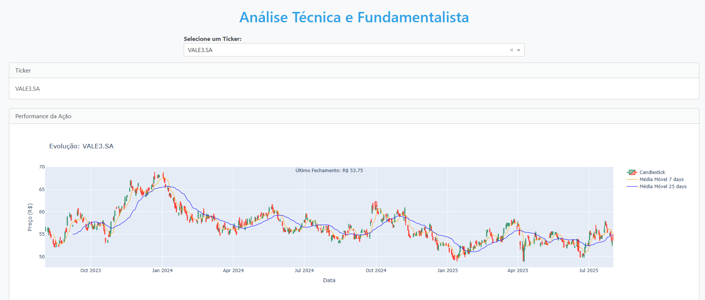
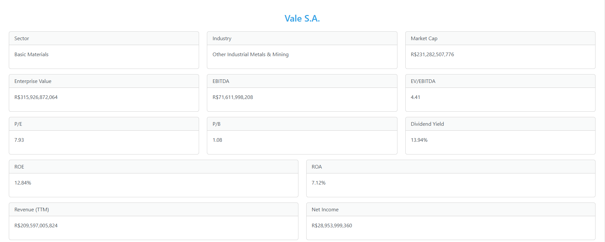

# 📈 Financial Market Shares Dashboard

This is a responsive and interactive web dashboard for analyzing the historical stock performance of selected Brazilian companies using data from Yahoo Finance.

## 🛠️ Technologies Used

- **[Dash](https://dash.plotly.com/)**: Web framework for building analytical web applications in Python.
- **[Plotly](https://plotly.com/python/)**: For interactive candlestick and moving average charts.
- **[Yahoo Finance API (via yfinance)](https://github.com/ranaroussi/yfinance)**: For retrieving real-time and historical financial data.
- **[Dash Bootstrap Components](https://dash-bootstrap-components.opensource.faculty.ai/)**: For modern, responsive layouts and styled components.
- **Pandas**: For data manipulation and time series calculations.

## 📊 Features

- Dropdown to select from 30+ Brazilian stock tickers.
- Candlestick chart with 7-day and 25-day moving averages.
- Key company financial metrics such as:
  - Market Cap
  - EBITDA
  - EV/EBITDA
  - P/E and P/B Ratios
  - ROE and ROA
  - Revenue and Net Income
- Business Summary and latest close price.

## 📸 App layout

### ➤ Main Dashboard View


### ➤ Company Info Cards


## 🚀 Getting Started Locally

```bash
git clone https://github.com/DaviBT/financial_market-technical_and_fundamental_analysis.git
cd financial_market-technical_and_fundamental_analysis
pip install -r requirements.txt
python app.py
```

Then go to `http://127.0.0.1:8050` in your browser.

## 📁 Project Structure

```
├── app.py                 # Main Dash application
├── flask_app.py           # Flask entrypoint (if deploying with WSGI)
├── requirements.txt       # Python dependencies
├── assets                 # Folder for UI images
└── README.md              # Project documentation
```

## 🧠 Inspiration

This project was built to practice financial data visualization and web development with Dash, and to provide a clean, elegant interface for analyzing key company metrics.

---

Feel free to fork the project, contribute or adapt it to your needs.
